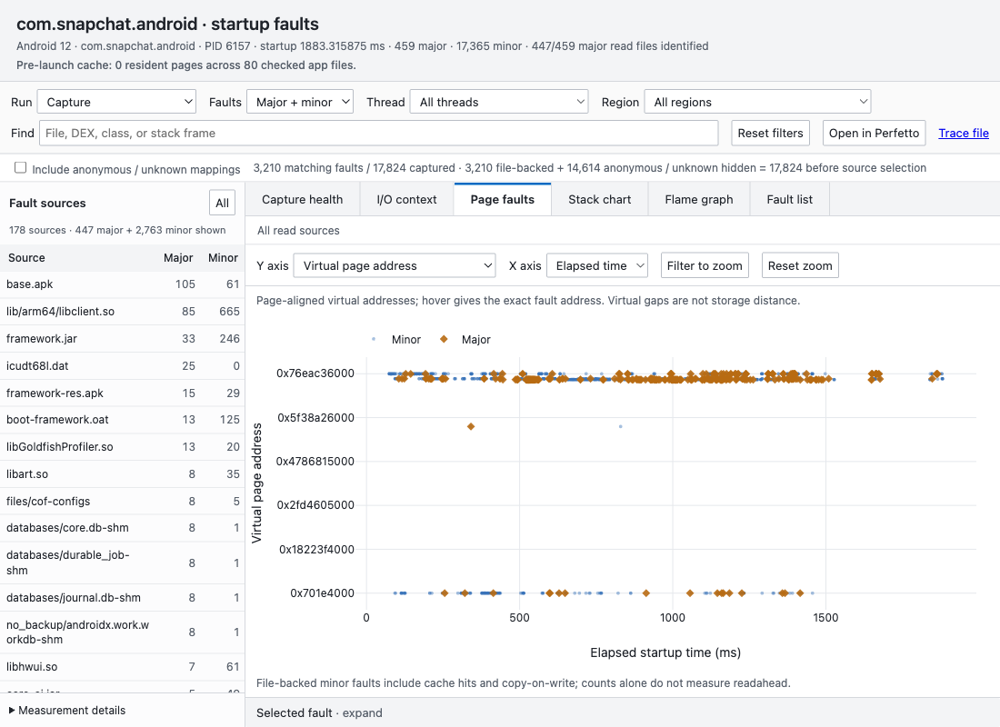

# Fault viewer interaction regressions

Run the model, accounting, and gesture-batching tests with `./gradlew testFaultViewer` (also included in `build`).

For real-browser coverage, open a generated Android fault report in Playwright CLI, then run the function in
`scripts/check_fault_report_interactions.js` using `playwright-cli run-code`. Serve the report directory on localhost
if the browser runner disallows file URLs. The script needs an Android capture with enough faults to exercise zoom;
it was verified against the Snapchat capture with 17,824 faults.

The browser cases cover:

- Source-table major totals equal file-backed majors by default; the hidden count explains the difference from the
  capture total. Including anonymous/unknown mappings reconciles all majors and makes them available in the fault list.
- Page-fault plots fill their own container at 1600×1000 and 1100×800 and after tab switching, even when I/O is hidden.
- Address tick labels and axis titles remain within chart bounds; lane names are not abbreviated and sidebar names wrap.
- Four full zoom gestures reach below 1% of the capture range; Escape restores the full range.

The Node regressions additionally cover frame batching, pointer anchoring, inverse zoom, line-delta normalization,
filter-change cancellation, disposal cancellation, and a 447 file-backed + 12 non-file-backed = 459 major-fault fixture.

Example after the layout correction:

