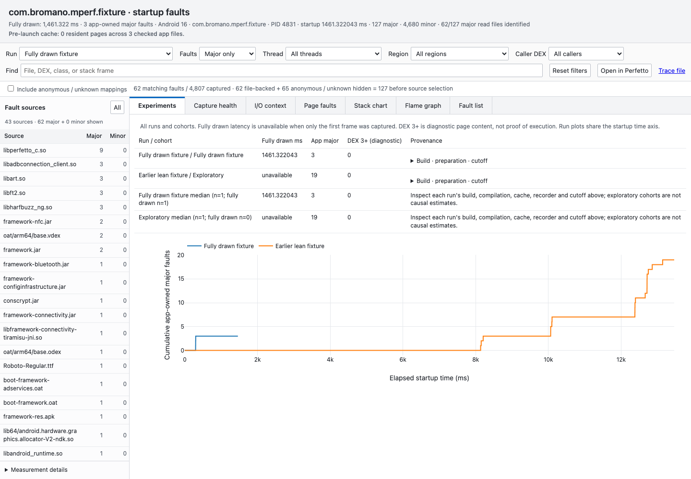

# Reproducible startup fault experiments

Start with fully drawn latency and **all app-owned major faults**. A fault on
`classes3.dex` or later is useful evidence about layout and startup coverage, but
methods stored on that page are not necessarily callers or executed methods.
The viewer separates faulted DEX, caller physical DEX, and page contents.
Caller DEX comes from an explicit stack file or a unique matching method definition
in the captured APKs. Multiple physical definitions remain ambiguous. The secondary
DEX caller filter applies to caller evidence, independently of the faulted region.

## Capture capacity and loss

```sh
mperf faults android -p com.example.app --out capture \
  --native-stacks --dwarf-stacks \
  --native-kernel-pages 1024 --native-max-samples 4000000 --native-max-mappings 400000 \
  --native-max-callchain-entries 32000000 \
  --dwarf-kernel-pages 8192 --dwarf-user-buffer-mb 512 \
  --perfetto-mode lean --settle-ms 3000 --no-open
```

Native defaults are 2,000,000 samples, 200,000 mappings, and 16,000,000
callchain entries. Native kernel rings default to 256 pages per CPU per event;
`--native-kernel-pages` tunes kernel ring loss separately. Capacities are system-wide. These are reservations, not a
promise that a device has enough memory. Larger buffers perturb available RAM;
keep recorder settings identical within an experiment.

Health reports separate native sample-array drops, mapping-array drops, perf ring
loss, kernel loss counters, and callchain overflow. The historical `collector_lost`
aggregate remains for compatibility. Ring-loss records and kernel counters can
represent the same lost records, so the aggregate uses the larger per-ring count.
All recorder stop signals precede waits for CSV export and Simpleperf post-unwind.
Native export and Simpleperf finalization have independent 120-second deadlines.

Google's [Simpleperf documentation](https://android.googlesource.com/platform/system/extras/+/master/simpleperf/doc/README.md#reduce-lost-samples-and-samples-with-truncated-stack)
and [record implementation](https://android.googlesource.com/platform/system/extras/+/refs/heads/main/simpleperf/cmd_record.cpp)
identify `-m` as kernel pages per CPU and `--user-buffer-size` as the userspace
buffer. These correspond to `--dwarf-kernel-pages` and `--dwarf-user-buffer-mb`.
The capture stays at period one, disables truncation and stack joining, and reports
kernel/user loss and truncated stacks separately. Rejected raw recordings are
preserved for diagnosis. Loss is never silently treated as complete coverage.

Lean Perfetto keeps startup markers and process/thread tracking, omits page-cache
insertions, detailed ART tracing, block I/O, I/O advice and scheduler-state evidence,
and records those omissions in metadata/health. It cannot be combined with
`--io-evidence`. Full mode retains the prior evidence. Both use discard buffers to
preserve initial startup data; trace integrity checks still reject data loss.
The exact final config and its hash are saved in the capture.

## Same-sample managed attribution

Stock Simpleperf currently omits `PERF_SAMPLE_ADDR` for `major-faults`. Timestamp,
PID, TID, CPU and IP agreement between two recorders does not make them one sample.
Stock `--dwarf-stacks` therefore retains an independent managed stack view and
never adds its Java callers to the native fault's page attribution.

For an Android-compatible Simpleperf build with address support, use
`--dwarf-recorder /path/to/simpleperf` alongside `--dwarf-stacks`. The CLI verifies
its ELF architecture, records its hash, and sideloads it to a separate path.
[scripts/simpleperf-fault-address.patch](../scripts/simpleperf-fault-address.patch)
adds `PERF_SAMPLE_ADDR` for major-fault events in Google's event-selection code.
In a compatible AOSP checkout, apply it in `system/extras` and build the Android
`simpleperf` target (`m simpleperf`) for the device's ABI/platform. This PR does not
ship a modified Google binary. Recorder readiness rejects incompatible builds
before launch.

The raw parser accepts the address-bearing post-unwind layout and checks every
sample's bounds, period, clock, process, thread, runtime IP, CPU and address.
A stack is added to a native fault only when the address occurs in the **same raw
record as the unwound callchain**, and both streams have a unique matching identity
and verified capture hashes. Address disagreement, duplicates, unknown layouts,
loss, or missing bindings disable enrichment. Unmatched native faults retain their
native stack. The patch is source-reviewed and the post-unwind layouts have binary
regression fixtures; an AOSP build/device validation of the modified recorder is
still required before using it for conclusions.

See the original reports on [mangled callstacks](https://github.com/android/ndk/issues/1840)
and [kept-method class deobfuscation](https://github.com/android/ndk/issues/1836).
No nearest-time matching, callchain joining, or artificial gap removal is used.

## Render without collection or preprocessing

```sh
mperf faults android --out capture --report-only --no-open \
  --symbol-dir debug-symbols \
  --r8-mapping mapping.txt --mapping-apk-sha256 APK_SHA256 \
  --startup-profile consumed-startup.txt --baseline-profile consumed-baseline.txt
```

`--report-only` reads existing processed tables; it does not invoke ADB or Trace
Processor, rewrite the metadata, or rerun preprocessing. `--skip-collect` retains
its existing meaning: rerun preprocessing on saved raw capture inputs.

The HTML includes input SHA-256 values, renderer version/code and asset hashes,
additional symbol/profile input hashes, and the selected symbolizer executable hash.
Inputs are rechecked before publication. A temporary file is renamed atomically;
a failed render leaves the previous `report.html` intact.

Native debug files must match both architecture and GNU build ID of the captured
ELF. Filenames are not identities. Missing IDs, wrong architectures and different
build IDs remain unresolved; conflicting debug files with the same identity are
rejected. Symbolication supports native file offsets and Simpleperf virtual
addresses in the ELF, including ELF members of captured APKs.

The mapping/profile APK hash is the user's explicit declaration of the exact build
that produced these inputs and must match a captured APK. mperf cannot independently
prove that a manually supplied mapping or profile was consumed by R8. Supply the
actual original-name text profiles from that build's inputs, not a later generated
profile or a binary ART profile. Build mismatches and unsupported profile formats
are rejected. Comparisons spanning builds should be rendered with the appropriate
inputs separately; a single mapping is never reused across a nonmatching build.

Mapping candidates preserve kept methods, inlined/merged origins and ambiguous
names. No unique overload is inferred without a signature. Profile audits list
candidates independently, distinguish class roots from explicit `<clinit>` method
roots, and mark absent roots. An absence is an investigation lead, not proof of an
R8 bug: verify mapping ambiguity, consumed profile identity, captured stack quality,
and why that caller executes. OAT collection failures record artifact, stage and
error in `oat-attribution-diagnostics.json` and capture warnings.

## Repeated controls and treatments

`--compare` remains available. For additional runs use `--cohort experiments.json`:

```json
[
  {"capture": "treatment-1", "label": "Treatment 1", "cohort": "Treatment"},
  {"capture": "treatment-2", "label": "Treatment 2", "cohort": "Treatment"},
  {"capture": "return-control", "label": "Return control", "cohort": "Control"}
]
```

Paths are relative to the manifest. The primary capture can be a pre-treatment
control labeled `Control`. Run plots share an x-axis, and the Experiments tab
shows cumulative app-owned major-fault curves for every run, including return controls, per-run readouts and cohort medians. Fully drawn values are null when the
cutoff is only the first frame; the fully drawn sample count is reported separately.
DEX 3+ remains a diagnostic breakdown. Per-run evidence includes APK hashes,
compilation before/after, cache verification, recorder configuration and cutoff.
Duplicate capture paths are rejected. `--allow-incomparable` is required for
exploratory comparisons with differing preparation/recorders/cutoffs; such medians
are descriptive, not causal estimates.



The screenshot is an exploratory UI check across different fixture setups, not a
measurement of a treatment effect.
